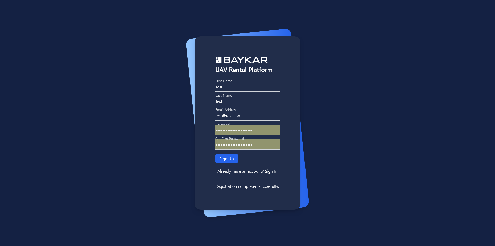
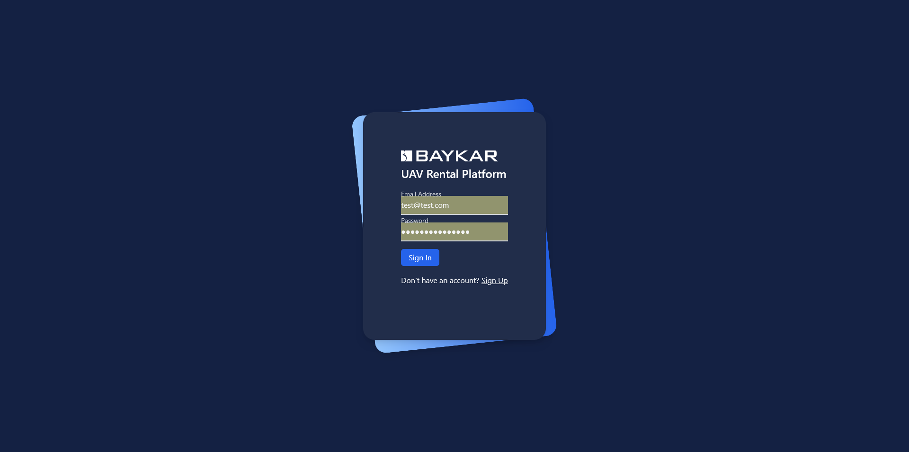
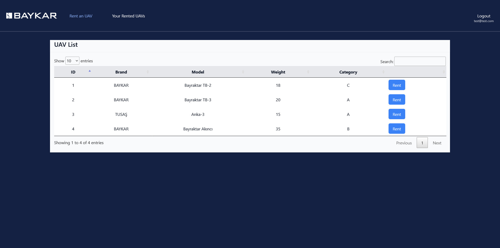
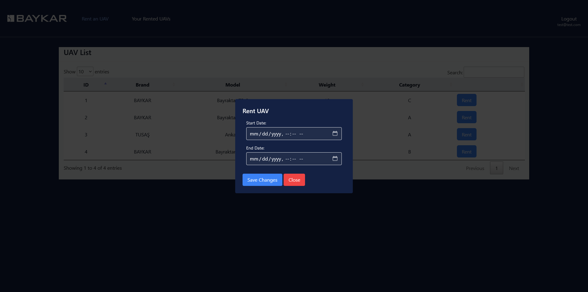
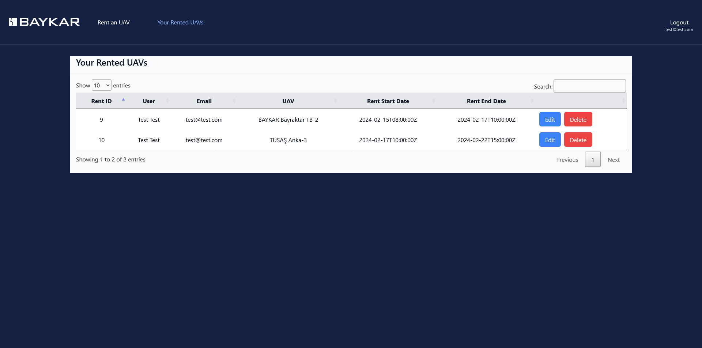
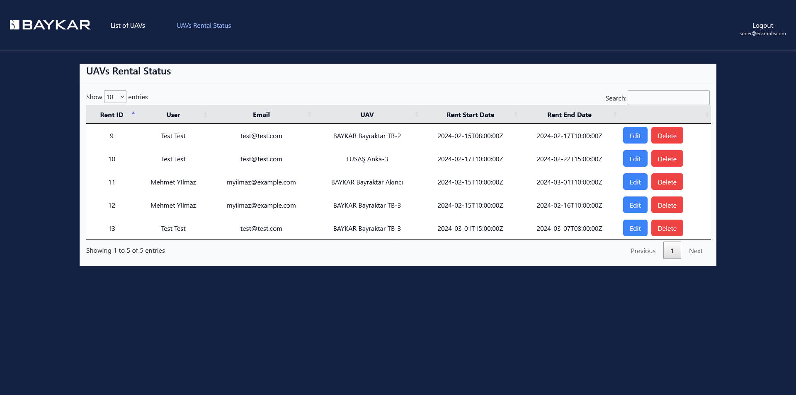
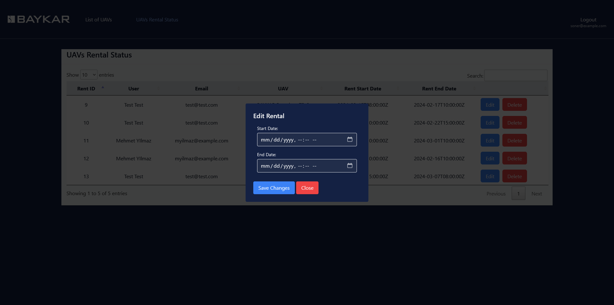
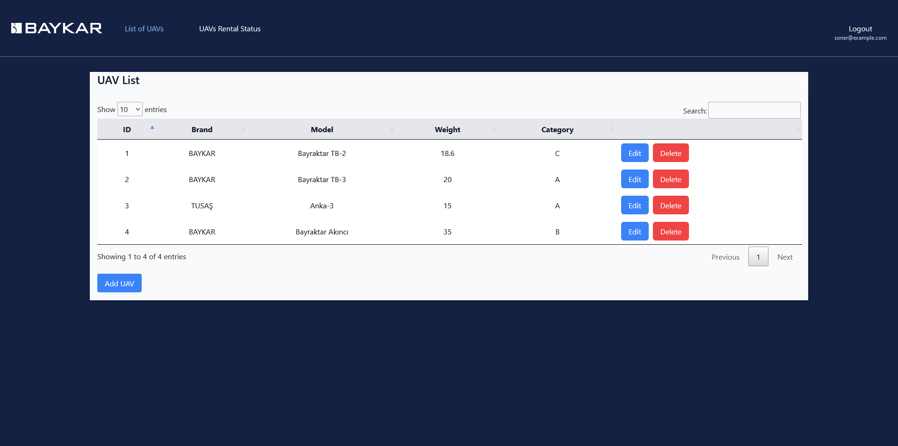
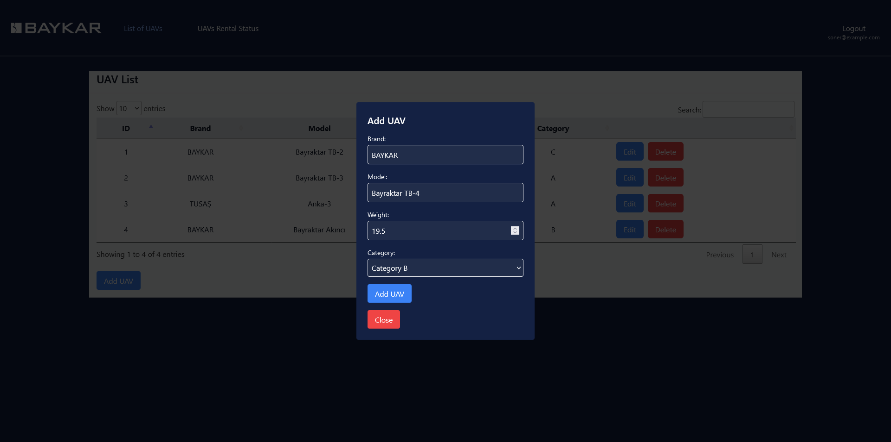

## Kurulum Aşamaları
```bash
git clone https://github.com/msoneri/baykar-uav-rent.git
cd baykarproject
python -m venv venv
source venv/bin/activate   # Windows için: venv\Scripts\activate
pip install -r requirements.txt
python manage.py migrate
python manage.py createsuperuser # Email alanını boş bırakmayınız
python manage.py runserver
```
Not: `settings.py` dosyasındaki postgres veri tabanı config'ini ayarlamayı unutmayınız.

## Teknik Özellikler
- Django
- Postgresql
- RESTful API
- Ajax ve Fetch ile asenkron yapı
- JQuery Datatables
- Tailwind CSS

## Uygulamanın Görselleri

### Üyelik ve giriş ekranları




### User ekranları







### Staff ekranları









